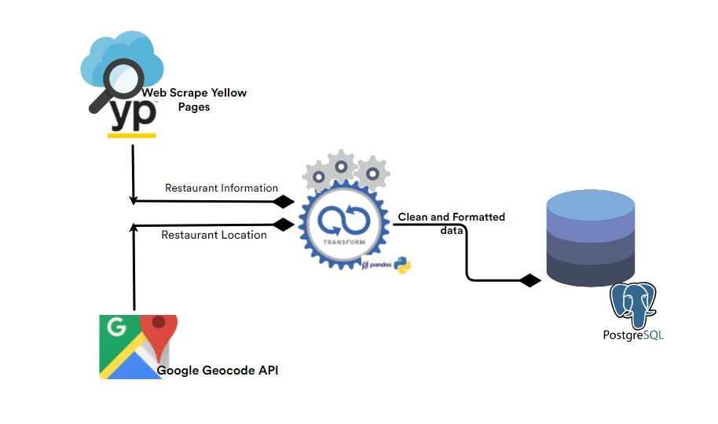
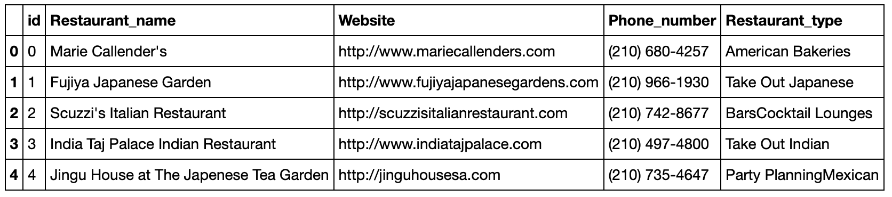
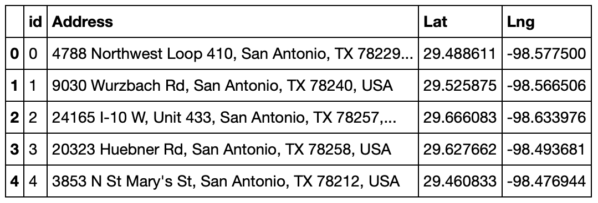

<<<<<<< HEAD
# ETL_project


## Table of contents
* [Project Title ](#project-title)
* [ETL Objective](#etl-objective)
* [ETL Diagram](#etl-diagram)
* [ETL Diagram](#etl-diagram)
* [Technologies](#technologies)
* [Code](#code)
* [Status](#status)
* [Acknowledgement ](#acknowledgement )
* [Contact](#contact)



## Project Title : Restaurants in San Antonio

Group Members: Quatrell Nevels, Shondeen Hechter, Divya Shetty


## Objective

Using the Yellow Pages website, San Antonio restaurant data will be extracted to provide information on restaurants to include what type of food they serve (category) and contact information. Additionally, Google GeoCode API will be used to obtain location.

## Data Sources:
	- [YellowPages](https://www.yellowpages.com/search?search_terms=restaurants&geo_location_terms=San+Antonio%2C+TX)
- [Google geocode API](https://maps.googleapis.com/maps/api/geocode/json)



## Procedure
### DB Schema:
Create a database __restaurant_db__ in PostgreSQL pgAdmin 4 and then create the following two tables:

- A restaurant_info table that contains the following,
	*  columns id, 
	* Restaurant_name, 
	* Website, Phone_number, and 
	* Restaurant_type

- A restaurant_location table that contains the following,
	* columns id, 
	* Address, 
	* Lat, and Lng


### ETL data-flow Model for SA Restaurant data

 
## Extraction:

* Using the Yellow Pages and Google GeoCode API identify what metatdata you need to extract that will assist in generating your list.

* Using the Beautiful Soup tool extract this information from the San Antonio Restaurants section of the Yellow Pages website:

* Using the Google GeoCode API extract the following metadata:

## 1. Yellow Pages:
* Restaurant Name
* Phone Number
* Restaurant Website
* Restaurant Type (category)

## 2. Google GeoCode API:
* Restaurant Address
* Restaurant Latitude
* Restaurant Longitude


## Transformation: 
Following actions are performed on the extracted data:

* Copy only the columns needed into a new DataFrame.
* Add an _id column to uniquely identify the restaurants
* Rename columns to fit the schema created in the database.
* Drop NANs or missing values.
* Handle any duplicates.
* (Hint) Before loading your transformed metadata into database, check to see if DataFrames needs any datatype conversions.

## Here is an example of what your DataFrames should look like once they are transformed:





## Load:

* Create a engine connection to database using __sqlalchemy create_engine__.
* Check for a successful connection to the database and confirm that the tables have been created.
* Append DataFrames to tables. Be sure to use the index set earlier.
* set __if_exists='replace'__ to ensure data is not appended to DB every time the script runs.
* Confirm successful LOAD by querying database.


## Future Research and Analysis , 

Future Research and Analysis of this metadata will allow developers to add hours of operations, ratings, and reviews to website to give customers amplifying information when searching for restaurants in San Antonio. 


## Technologies and Tools
* Jupyter Notebook
* chrome DOM
* pandas
* Web Scraping libraries
	* splinter
	* beautifulsoup4
	* webdriver_manager
* API libraries
	* request
	* json
* Database library
	* sqlalchemy
	
	

## Code 
- [ETL-RestaurantData script](/ETL-RestaurantData.ipynb)



## Setup
1. Git clone this repository
2. Open [ETL-RestaurantData script](/ETL-RestaurantData.ipynb) in jupyter notebook.
3. Import [SQL Schema](/schema.sql) file into your PostgreSQL database to create tables.
4. Execute the code and check PostgreSQL DB to ensure extracted data has been loaded to the tables.


## Status
Project Complete

## Acknowledgement 
- Data for this project came from [YellowPages.com](https://www.yellowpages.com/search?search_terms=restaurants&geo_location_terms=San+Antonio%2C+TX) and Google API


## Contributors
- [Shondeen Hechter](https://github.com/shechter430), [Divya Shetty](https://github.com/divya-gh) and
[Quatrell Nevels](https://github.com/qrnevel)  



 






















