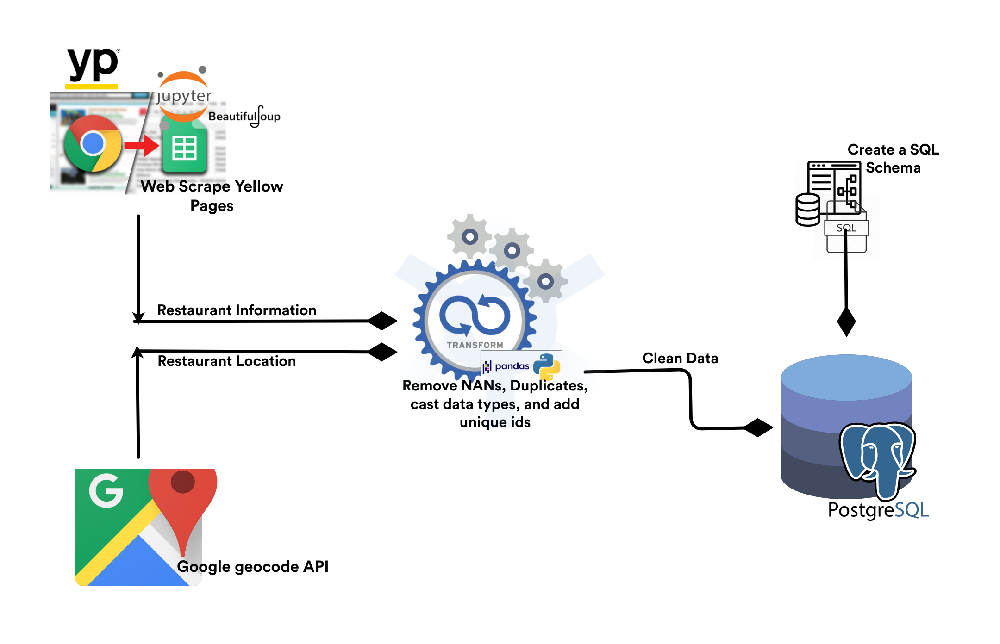

# ETL_project


## Table of contents
* [Project Title ](#project-title)
* [ETL Objective](#etl-objective)
* [ETL Diagram](#etl-diagram)
* [Technologies](#technologies)
* [Code](#code)
* [Status](#status)
* [Acknowledgement ](#acknowledgement )
* [Contact](#contact)



## Project Title : 

### Description: *Using the yellow pages website, San Antonio restaurant data will be extracted to provide restaurant information including contact information. Additionally, google geocode API will be used to obtain location.*

## Objective

### ETL data-flow Model for SA Restaurant data

 

## Data Sources:
	- Yellowpages[[YellowPages.com](./Images/yp.png](https://www.yellowpages.com/search?search_terms=restaurants&geo_location_terms=San+Antonio%2C+TX)
	- Google geocode API[geocode](./Images/geocode.png)


## Extraction:


## Transformation:


## Load:

## Future Research and analysis , 




## Screenshots
- Restaurant Info : 

- Restaurant Location : 


## Technologies and Tools
* Jupyter Notebook
* chrome DOM
* pandas
* Web Scraping libraries
	* splinter
	* beautifulsoup4
	* webdriver_manager
* API libraries
	* request
	* json
* Database library
	* sqlalchemy
	
	

## Code 
- [ETL-RestaurantData script](/ETL-RestaurantData.ipynb)



## Setup
1. Git clone this repository
2. Open [ETL-RestaurantData script](/ETL-RestaurantData.ipynb) in jupyter notebook.
3. Import [SQL Schema](/schema.sql) file into your PostgreSQL database to create tables.
4. Execute the code and check PostgreSQL DB to ensure extracted data has been loaded to the tables.


## Status
Project Complete

## Acknowledgement 
- Data for this project came from [YellowPages.com](https://www.yellowpages.com/search?search_terms=restaurants&geo_location_terms=San+Antonio%2C+TX) and Google API


## Contributors
- [Shondeen Hechter](https://github.com/shechter430), [Divya Shetty](https://github.com/divya-gh) and
[Quatrell Nevels]() 


 























